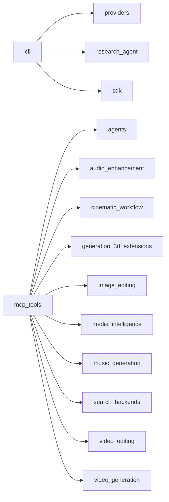

# Architecture — Single Canonical System

> One repository. One main branch. One execution pipeline. One SDK.
> Every component has exactly one logical home in `ai_generation/`.

## Module Dependency Graph

Nodes: `ai_generation/` Python modules. Edges: import dependency (module -> imported module).

## Modules with no internal dependencies (leaf nodes)

`agent_interface`, `agent_planner`, `asset_intelligence`, `audio_enhancement`, `audio_generation`, `auto_router`, `benchmark_engine`, `benchmark_lab`, `browser_ai`, `capability_graph`, `capability_matrix`, `capability_registry`, `character_manager`, `cinema_benchmark`, `cinematic_workflow`, `code_analysis`, `decision_ledger`, `document_intelligence`, `dynamic_adapter`, `edge_ai`, `event_bus`, `execution_engine`, `execution_strategies`, `failure_recovery`, `generation_3d`, `generation_3d_extensions`, `generation_manager`, `health_monitor`, `image_editing`, `knowledge_graph`, `local_runtimes`, `media_intelligence`, `music_generation`, `negotiation_engine`, `observability`, `ocr_engine`, `orchestration`, `otel_export`, `plugin_extensions`, `plugin_system`, `project_manager`, `prompt_engine`, `provider_discovery`, `provider_intelligence`, `provider_verifier`, `quality_dashboard`, `quality_engine`, `quality_engineering`, `refactoring_engine`, `regression_detector`, `remote_endpoints`, `research_agent`, `sdk`, `search_backends`, `search_systems`, `security`, `security_crypto`, `supervisor`, `video_editing`, `video_generation`, `voice_cloning`, `workflow_engine`

## Layer Map

| Layer | Home |
|---|---|
| Unified SDK | `ai_generation/sdk.py` |
| Core (execution, negotiation, planning, registry, supervisor) | `ai_generation/{execution_engine,negotiation_engine,agent_planner,capability_registry,supervisor}.py` |
| Providers | `ai_generation/providers/` |
| Runtimes | `ai_generation/local_runtimes.py`, `ai_generation/remote_endpoints.py` |
| Models | `ai_generation/models.py` (via registry in `data/`) |
| MCP | `ai_generation/mcp_tools.py` + `configs/mcp_servers.json` |
| Skills | `knowledge-vault/07-Skills/` |
| Plugins | `ai_generation/plugin_system.py`, `plugin_extensions.py` |
| Agent Frameworks | `ai_generation/agents/`, `agent_interface.py` |
| Security | `ai_generation/security.py`, `security_crypto.py` |
| Observability | `ai_generation/observability.py`, `otel_export.py` |
| Benchmarking | `ai_generation/benchmark_engine.py`, `benchmark_lab.py`, `cinema_benchmark.py` |
| Quality | `ai_generation/quality_engineering.py`, `quality_dashboard.py`, `code_analysis.py` |
| Knowledge | `knowledge-vault/` |
| Infrastructure | `Dockerfile`, `.github/workflows/` |
| Testing | `ai_generation/tests/` |
| Tools | `ai_generation/cli.py`, `scripts/` |

## Dependency Verification

- Nodes: 66 (`ai_generation/` modules incl. `providers/` and `agents/` subpackages)
- Edges: 14 explicit intra-package imports
- Cycles: **none** — the graph is acyclic
- Coupling: intentionally low; modules are wired together through the unified SDK (`sdk.py` lazy-loads every engine property)

## Ownership

| Component | Owner | Canonical home |
|---|---|---|
| SDK | `UncleFrappeAI` | `ai_generation/sdk.py` |
| Execution pipeline | `ExecutionEngine` | `ai_generation/execution_engine.py` |
| Router | `AutoRouter` | `ai_generation/auto_router.py` |
| Planner | `AgentPlanner` | `ai_generation/agent_planner.py` |
| Capability registry | `CapabilityGraph` | `ai_generation/capability_registry.py` |
| Supervisor | `SupervisorTree` | `ai_generation/supervisor.py` |
| Negotiation | `NegotiationEngine` | `ai_generation/negotiation_engine.py` |
| Providers | provider classes | `ai_generation/providers/` |
| MCP tools | `MCPGenerationTools` | `ai_generation/mcp_tools.py` |
| CLI | `main()` | `ai_generation/cli.py` |
| Knowledge system | Obsidian vault | `knowledge-vault/` |

## Consolidation Record

Removed parallel implementations (history preserved in git):

- `core_platform/` — legacy platform migration (duplicate engines, agents, RAG, vector store, health, quality)
- `sections/` — legacy sections framework
- `wrappers/` — legacy web scraping stack
- `mcp_adapters/` — legacy MCP adapter (external MCP server config merged into `configs/mcp_servers.json`)
- `docker/` — legacy compose stack (superseded by root `Dockerfile`)
- `browser_agents/` — legacy browser agent stack (superseded by `ai_generation/browser_ai.py`)
- `health_checks/` — superseded by `ai_generation/health_monitor.py`
- `main.py` — legacy entry point (superseded by `ai_generation/cli.py`)

## Repository Topology

| Role | Canonical home | Status |
|---|---|---|
| Production implementation (this repo) | `rishabhchawdaai-design/Uncle-Frappe-AI-Generation-Platform` | canonical `main`, no forks, single branch |
| Research canon (source of ideas) | `rishabhchawdaai-design/ACOS-Research` | upstream knowledge source, mirrored into `knowledge-vault/` |
| Research working notes | `rishabhchawdaai-design/Uncle-Frapp-` | upstream knowledge source |
| Obsidian knowledge system | `knowledge-vault/` inside this repo | generated from code + research |

No forks exist. Every GitHub repository has exactly one branch (`main`).
External MCP servers: `configs/mcp_servers.json`. Reference repositories used
for quality-engineering pattern extraction live outside the canonical tree and
are never imported.
