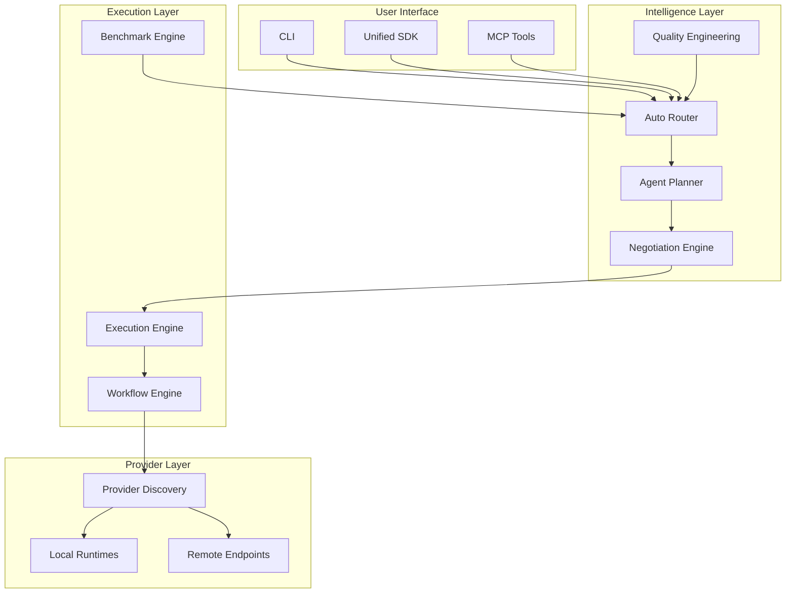

# Architecture Overview

## System Identity

The Uncle Frappe AI Generation Platform is a **Universal AI Generation Operating System** — an orchestration platform that automatically discovers, benchmarks, and utilises every compatible AI generation capability across local, remote, and distributed execution resources.

## Architecture Principles

1. **Repository as Intelligence** — The repository itself is the intelligence layer
2. **Dynamic Routing** — Never assume one model/provider/backend is best
3. **Continuous Benchmarking** — Every routing decision is benchmark-driven
4. **Modular Extension** — Everything is a plugin, skill, or provider
5. **Unified API** — One API for all AI generation capabilities

## Core Architecture Layers

## Module Map

| Layer | Modules | Purpose |
|-------|---------|---------|
| Entry | `sdk.py`, `cli.py`, `mcp_tools.py` | User-facing interfaces |
| Intelligence | `auto_router.py`, `agent_planner.py`, `negotiation_engine.py` | Decision making |
| Quality | `quality_engineering.py`, `quality_dashboard.py`, `code_analysis.py` | Quality assurance |
| Execution | `execution_engine.py`, `workflow_engine.py`, `benchmark_engine.py` | Task execution |
| Generation | `generation_manager.py`, `image_editing.py`, `video_generation.py` | AI generation |
| Providers | `provider_discovery.py`, `provider_intelligence.py`, `local_runtimes.py` | Provider management |
| Observability | `observability.py`, `otel_export.py`, `health_monitor.py` | Monitoring |
| Security | `security.py`, `security_crypto.py` | Security |
| Knowledge | `knowledge_graph.py`, `research_agent.py` | Knowledge management |

## Related

- [[02-Capability-Registry/Capability Registry Overview|Capability Registry]]
- [[01-Architecture/Decision-Records/ADR Index|ADRs]]
- [[03-Execution-Engine/Execution Engine Overview|Execution Engine]]
- [[05-SDK/SDK Overview|SDK]]

## Single Canonical Architecture (Consolidation)

The platform is a single engineering system. All implementation lives in
`ai_generation/`; the authoritative architecture, ownership map, dependency
graph, and consolidation record live in the repository root:

- `ARCHITECTURE.md` — layer map, ownership, verified acyclic dependency graph
  (66 nodes, 14 edges, no cycles), repository topology, consolidation record

Parallel legacy stacks (`core_platform/`, `sections/`, `wrappers/`,
`mcp_adapters/`, `docker/`, `browser_agents/`, `health_checks/`, `main.py`)
were removed from the tree; history is preserved in git.
