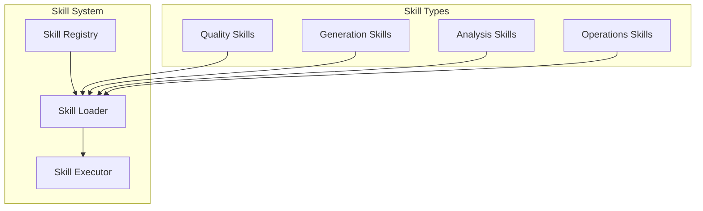

# Skills Overview

## Unified Skill Registry

`configs/skills.json` is the single canonical skill registry:
**80 skills catalogued — 78 ready, 2 blocked**. 40 platform-native skills map
to verified modules; 38 external skill-pack references cover all objective
categories. Surfaces:

- SDK: `ai.list_skills()`, `ai.get_skill()`, `ai.get_skill_registry_stats()`
- CLI: `python -m ai_generation.cli skills [--category|--status|--search]`
- MCP: `list_skills`, `get_skill`

## Skill Categories

### Quality Skills
- Quality Gate Runner
- Code Review Specialist
- Test Generator
- Coverage Analyzer
- Refactoring Advisor

### Generation Skills
- Image Prompt Enhancer
- Video Script Writer
- Audio Prompt Optimizer
- 3D Scene Designer

### Analysis Skills
- Secret Scanner
- Static Analyzer
- Structural Analyzer
- Dependency Auditor

### Operations Skills
- Provider Health Monitor
- Benchmark Runner
- Regression Detector
- Failure Recovery

## Skill Architecture

## Related

- [[Architecture Overview]]
- [[Plugin System Overview]]
- [[Quality Engineering Overview]]
