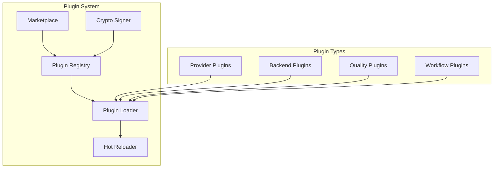

# Plugin System Overview

## Plugin Architecture

## Plugin Components

| Component | Module | Purpose |
|-----------|--------|---------|
| PluginSystem | `plugin_system.py` | Core plugin management |
| PluginExtensions | `plugin_extensions.py` | Marketplace, hot-reload, signing |

## Plugin Lifecycle

1. **Discovery** — Find available plugins
2. **Installation** — Install plugin files
3. **Loading** — Load plugin into runtime
4. **Registration** — Register plugin capabilities
5. **Execution** — Execute plugin functionality
6. **Hot Reload** — Reload on changes
7. **Verification** — Verify plugin integrity

## Related

- [[Architecture Overview]]
- [[Skills Overview]]
- [[MCP Ecosystem Overview]]
