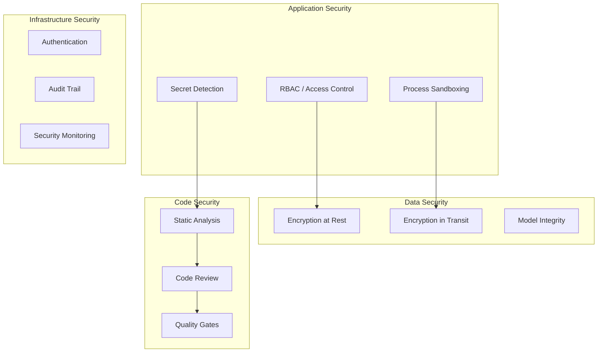

# Security Architecture

## Security Layers

## Security Components

| Component | Module | Purpose | Status |
|-----------|--------|---------|--------|
| SecurityManager | `security.py` | RBAC, access control | ✅ VERIFIED |
| ProcessSandbox | `security.py` | Process isolation | ✅ VERIFIED |
| EncryptionAtRest | `security_crypto.py` | Data encryption | ✅ VERIFIED |
| EncryptionInTransit | `security_crypto.py` | TLS/SSL | ✅ VERIFIED |
| ModelSecurity | `security_crypto.py` | Model integrity | ✅ VERIFIED |
| SecretScanner | `code_analysis.py` | Secret detection | ✅ VERIFIED |
| StaticAnalyzer | `code_analysis.py` | Security analysis | ✅ VERIFIED |
| QualityGateEngine | `quality_engineering.py` | Security gates | ✅ VERIFIED |
| DecisionLedger | `decision_ledger.py` | Audit trail | ✅ VERIFIED |

## Threat Model

| Threat | Mitigation | Component |
|--------|------------|-----------|
| Hardcoded secrets | Secret scanning | SecretScanner |
| Code injection | Static analysis | StaticAnalyzer |
| Unauthorized access | RBAC | SecurityManager |
| Data breach | Encryption | EncryptionAtRest |
| Model tampering | Integrity checks | ModelSecurity |
| Process escape | Sandboxing | ProcessSandbox |

## Related

- [[Quality Engineering Overview]]
- [[Architecture Overview]]
- [[Failure Atlas Overview]]
