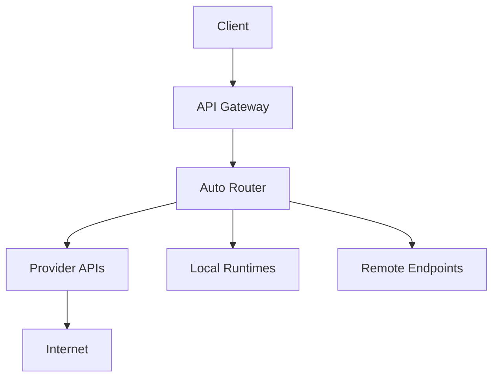

# Networking Overview

## Network Architecture

## Components

| Component | Module | Status |
|-----------|--------|--------|
| RemoteEndpoints | `remote_endpoints.py` | ✅ VERIFIED |
| ProviderDiscovery | `provider_discovery.py` | ✅ VERIFIED |
| HealthMonitor | `health_monitor.py` | ✅ VERIFIED |
| Service Mesh | BLOCKED | External dependency |

## Blocked Networking

| Capability | Blocker |
|------------|---------|
| Cilium | Requires K8s |
| Istio | Requires K8s |
| Linkerd | Requires K8s |
| Envoy | Requires K8s |

## Related

- [[Architecture Overview]]
- [[Infrastructure Overview]]
- [[Observability Overview]]
